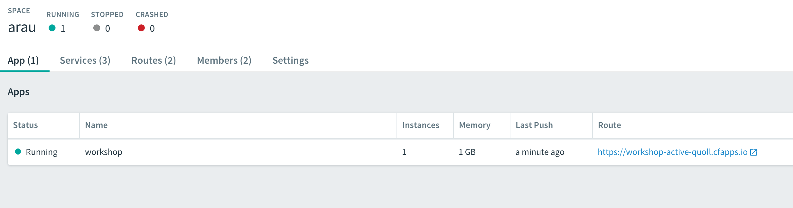
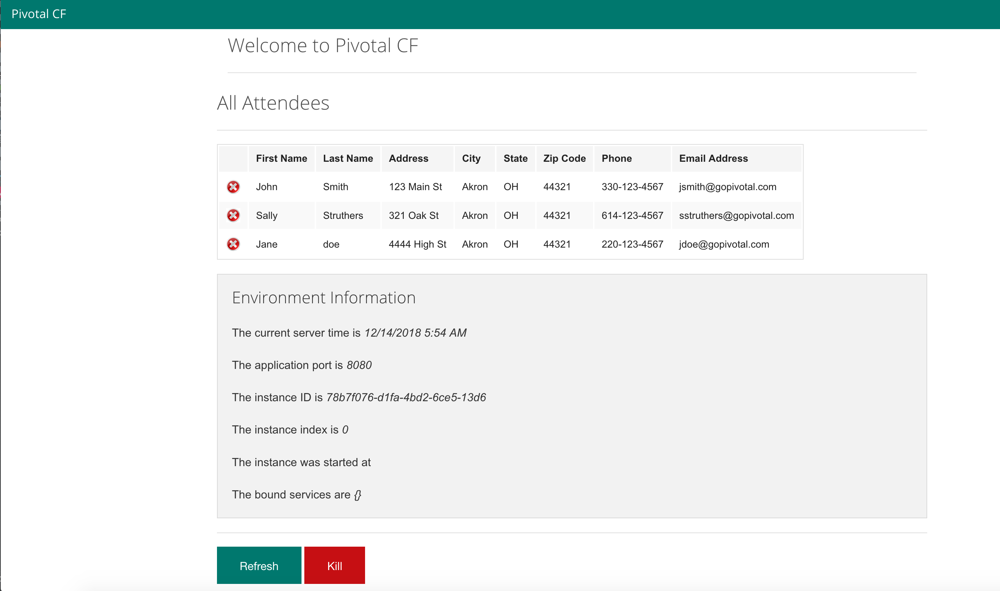

= https://pivotal.io/platform/pivotal-application-service[Pivotal Application Service (PAS) ] 101

== Purpose

Deploy a simple Java Spring Boot application to Pivotal PAS.

== Setup

. Download and install http://jdk.java.net/8/[Java 8] or above for your Operating system and make sure JAVA_HOME is set to your JDK directory.

. Download and install https://git-scm.com/book/en/v2/Getting-Started-Installing-Git[git] for your operating system and install it.

. Contact your company's PAS Admin to create an account for you on PAS and login to the PCF Apps Manager.
Alternatively go to https://pws.pivotal.io/ and create a free account on Pivotal Web Services (PWS) which is public.

. Login to PCF Apps Manager and click on *Tools* on the left navigation bar and download and install
the Cloud Foundry CLI for your operating system.

. Open your terminal and login in using CF CLI with the api endpoint shown on the *Tools* page ( for PWS it is https://api.run.pivotal.io ):

    $ cf login -a <your api enpoint>

Follow the prompts to enter your username and password. If you have multiple Orgs or spaces, you will be asked to select
 an Org and space where applications should be deployed when you do a "cf push".

== Build It

Linux/macOS

    $ ./mvnw package

Windows
----
> mvnw.bat package
----

== Push It!

Push the application!

----
$ cf push
----

You should see output similar to the following listing. Take a look at the listing callouts for a play-by-play of what's happening:

----
arau-macbook:PAS-101 arau$ cf push
Pushing from manifest to org Southeast / space arau as arau@pivotal.io...
Using manifest file /Users/arau/workshops/PAS-101/manifest.yml
Getting app info...
Creating app with these attributes...
+ name:        workshop
  path:        /Users/arau/workshops/PAS-101/target/cf-spring-mvc-boot-0.0.1-SNAPSHOT.jar
+ instances:   1
+ memory:      1G
  routes:
+   workshop-active-quoll.cfapps.io

Creating app workshop...
Mapping routes...
Comparing local files to remote cache...
Packaging files to upload...
Uploading files...
 770.58 KiB / 770.58 KiB [=========================================================================================================================] 100.00% 1s

Waiting for API to complete processing files...

Staging app and tracing logs...
   Downloading dotnet_core_buildpack_beta...
   Downloading nodejs_buildpack...
   Downloading dotnet_core_buildpack...
   Downloading python_buildpack...
   Downloading staticfile_buildpack...
   Downloaded nodejs_buildpack
   Downloading java_buildpack...
   Downloaded python_buildpack
   Downloading ruby_buildpack...
   Downloaded dotnet_core_buildpack_beta
   Downloading go_buildpack...
   Downloaded dotnet_core_buildpack
   Downloading php_buildpack...
   Downloaded go_buildpack
   Downloading binary_buildpack...
   Downloaded ruby_buildpack
   Downloaded staticfile_buildpack
   Downloaded java_buildpack
   Downloaded php_buildpack
   Downloaded binary_buildpack
   Cell e3f7d063-352c-4e7d-b208-7c91b098b8f8 creating container for instance 7c8d2763-2665-4913-a3db-c5a9d36b3cc2
   Cell e3f7d063-352c-4e7d-b208-7c91b098b8f8 successfully created container for instance 7c8d2763-2665-4913-a3db-c5a9d36b3cc2
   Downloading app package...
   Downloaded app package (26.7M)
   -----> Java Buildpack v4.16.1 (offline) | https://github.com/cloudfoundry/java-buildpack.git#41b8ff8
   -----> Downloading Jvmkill Agent 1.16.0_RELEASE from https://java-buildpack.cloudfoundry.org/jvmkill/trusty/x86_64/jvmkill-1.16.0_RELEASE.so (found in cache)
   -----> Downloading Open Jdk JRE 1.8.0_192 from https://java-buildpack.cloudfoundry.org/openjdk/trusty/x86_64/openjdk-1.8.0_192.tar.gz (found in cache)
          Expanding Open Jdk JRE to .java-buildpack/open_jdk_jre (1.2s)
          JVM DNS caching disabled in lieu of BOSH DNS caching
   -----> Downloading Open JDK Like Memory Calculator 3.13.0_RELEASE from https://java-buildpack.cloudfoundry.org/memory-calculator/trusty/x86_64/memory-calculator-3.13.0_RELEASE.tar.gz (found in cache)
          Loaded Classes: 16170, Threads: 250
   -----> Downloading Client Certificate Mapper 1.8.0_RELEASE from https://java-buildpack.cloudfoundry.org/client-certificate-mapper/client-certificate-mapper-1.8.0_RELEASE.jar (found in cache)
   -----> Downloading Container Security Provider 1.16.0_RELEASE from https://java-buildpack.cloudfoundry.org/container-security-provider/container-security-provider-1.16.0_RELEASE.jar (found in cache)
   -----> Downloading Spring Auto Reconfiguration 2.5.0_RELEASE from https://java-buildpack.cloudfoundry.org/auto-reconfiguration/auto-reconfiguration-2.5.0_RELEASE.jar (found in cache)
   Exit status 0
   Uploading droplet, build artifacts cache...
   Uploading build artifacts cache...
   Uploading droplet...
   Uploaded build artifacts cache (132B)
   Uploaded droplet (73.4M)
   Uploading complete
   Cell e3f7d063-352c-4e7d-b208-7c91b098b8f8 stopping instance 7c8d2763-2665-4913-a3db-c5a9d36b3cc2
   Cell e3f7d063-352c-4e7d-b208-7c91b098b8f8 destroying container for instance 7c8d2763-2665-4913-a3db-c5a9d36b3cc2
   Cell e3f7d063-352c-4e7d-b208-7c91b098b8f8 successfully destroyed container for instance 7c8d2763-2665-4913-a3db-c5a9d36b3cc2

Waiting for app to start...

name:              workshop
requested state:   started
routes:            workshop-active-quoll.cfapps.io
last uploaded:     Fri 14 Dec 01:02:23 EST 2018
stack:             cflinuxfs2
buildpacks:        client-certificate-mapper=1.8.0_RELEASE container-security-provider=1.16.0_RELEASE
                   java-buildpack=v4.16.1-offline-https://github.com/cloudfoundry/java-buildpack.git#41b8ff8 java-main java-opts java-security
                   jvmkill-agent=1.16.0_RELEASE open-jd...

type:            web
instances:       1/1
memory usage:    1024M
start command:   JAVA_OPTS="-agentpath:$PWD/.java-buildpack/open_jdk_jre/bin/jvmkill-1.16.0_RELEASE=printHeapHistogram=1 -Djava.io.tmpdir=$TMPDIR
                 -Djava.ext.dirs=$PWD/.java-buildpack/container_security_provider:$PWD/.java-buildpack/open_jdk_jre/lib/ext
                 -Djava.security.properties=$PWD/.java-buildpack/java_security/java.security $JAVA_OPTS" &&
                 CALCULATED_MEMORY=$($PWD/.java-buildpack/open_jdk_jre/bin/java-buildpack-memory-calculator-3.13.0_RELEASE -totMemory=$MEMORY_LIMIT
                 -loadedClasses=16949 -poolType=metaspace -stackThreads=250 -vmOptions="$JAVA_OPTS") && echo JVM Memory Configuration: $CALCULATED_MEMORY &&
                 JAVA_OPTS="$JAVA_OPTS $CALCULATED_MEMORY" && MALLOC_ARENA_MAX=2 SERVER_PORT=$PORT eval exec $PWD/.java-buildpack/open_jdk_jre/bin/java
                 $JAVA_OPTS -cp $PWD/. org.springframework.boot.loader.JarLauncher
     state     since                  cpu    memory        disk           details
#0   running   2018-12-14T06:02:49Z   0.0%   47.6M of 1G   155.8M of 1G
----

Open PCF Apps Manager in a browser and navigate to your Space and you should see the workshop application running.

Visit the application in your browser by clicking on the URL under *Route* that was generated (It is also an output of 'cf push'):

== Interact with App from CF CLI

Get information about the currently deployed application using CLI apps command:

----
$ cf apps
----

Get information about running instances, memory, CPU, and other statistics using CLI instances command

----
$ cf app workshop
----

== Bonus Points: Kill the app

Click on the red *Kill* button on the application page and observe via the CLI or Apps Manager the app is restarted automatically.
